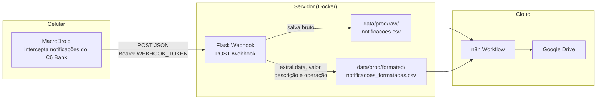

# Webhook Notificações — C6 Bank

Webhook em Flask que recebe as notificações do **C6 Bank** capturadas pelo **MacroDroid** no celular, salva os dados brutos e uma versão formatada em CSV, para depois um workflow no **n8n** subir esses arquivos para o Google Drive.

Roda em Docker no servidor pessoal (hoje só o ambiente `prod` está ativo e recebendo dados; `dev` existe para testes).

## Como funciona



## Formato da notificação

O MacroDroid envia um POST para `/webhook` com o header `Authorization: Bearer <WEBHOOK_TOKEN>` e um JSON:

```json
{
  "app": "C6 Bank",
  "titulo": "Compra no crédito aprovada",
  "texto": "Sua compra no cartão final 1234 no valor de R$ 1,00, dia 16/06/2025 às 12:52, em MARABRAS So Paulo BRA, foi aprovada."
}
```

Saídas:

- `data/{env}/raw/notificacoes.csv` — todas as notificações, com `timestamp, app, titulo, texto`.
- `data/{env}/formated/notificacoes_formatadas.csv` — só mensagens reconhecidas, com `data, valor, descricao, tipo_operacao` (operacões suportadas: `PIX`, `CREDITO`, `TAG`).

O parsing das mensagens acontece em `webhook_server/utils.py` (`parse_notification`, padrões `PADRAO_PIX`/`PADRAO_CREDITO`/`PADRAO_TAG`) — se o C6 mudar o texto das notificações, os regex precisam ser ajustados lá, com caso de teste novo usando o texto real.

## Idempotência e observabilidade

- **Dedup em janela deslizante**: notificações idênticas (`app`+`titulo`+`texto`) recebidas dentro de `DEDUP_WINDOW_MINUTES` são ignoradas (retries do MacroDroid não viram linha duplicada). Sem ID único no payload, o dedup é por conteúdo exato em memória — reiniciar o container zera a janela e repetições legítimas dentro dela também são ignoradas (por isso a janela deve ser curta).
- **Logs estruturados** no formato `evento=chave=valor` — parseáveis por grep/Loki/n8n.
- **`GET /stats`** — contadores (`recebidas`, `parseadas`, `nao_reconhecidas`, `duplicatas_ignoradas`) e `taxa_reconhecimento`. Serve de alerta barato de drift: se o C6 mudar o formato das notificações, a taxa despenca e fica visível logo. Contadores zeram a cada restart.

## Rodando com Docker

```bash
docker compose up -d --build webhook-prod   # prod na porta 5000 (único ambiente ativo hoje)
docker compose up -d --build webhook-dev    # dev na porta 5001 (para testes locais)
```

O diretório `data/` é montado como volume, então os CSVs ficam no host e sobrevivem a rebuilds do container.

## Rodando local (sem Docker)

1. Instale as dependências: `poetry install`
2. Rode: `poetry run python -m webhook_server.webhook_server`

## Testes

```
poetry run pytest
```

Cobrem o parsing dos formatos de notificação (PIX, crédito, TAG) com textos reais e o comportamento do endpoint `/webhook` (autenticação, erros e gravação nos CSVs). Ao adicionar um novo formato em `parse_notification`, adicione o caso de teste correspondente em `tests/test_utils.py`.

## Configuração

| Variável de ambiente | Padrão | Descrição |
|---|---|---|
| `WEBHOOK_ENV` | `prod` | Define se grava em `data/prod` ou `data/dev` |
| `WEBHOOK_TOKEN` | `token_teste` | Token do header `Authorization` (defina no `.env`) |
| `DEDUP_WINDOW_MINUTES` | `10` | Janela do dedup de notificações idênticas (minutos) |

## Rotas

- `POST /webhook` — recebe a notificação (exige `Bearer` token); ignora duplicatas na janela.
- `GET /stats` — contadores e taxa de reconhecimento (zeram a cada restart).
- `GET /ping` — health check, retorna `{"message": "Pong"}`.

## Observações

- O token e outros segredos ficam no `.env` (não versionado).
- Mensagens com título não reconhecido são salvas só no CSV bruto, com log `evento=notificacao_nao_reconhecida`.
- O n8n lê os CSVs de `data/` e faz o upload para o Drive — o upload não é responsabilidade deste serviço.
